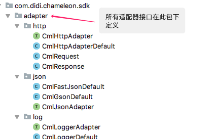
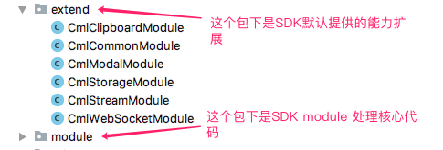
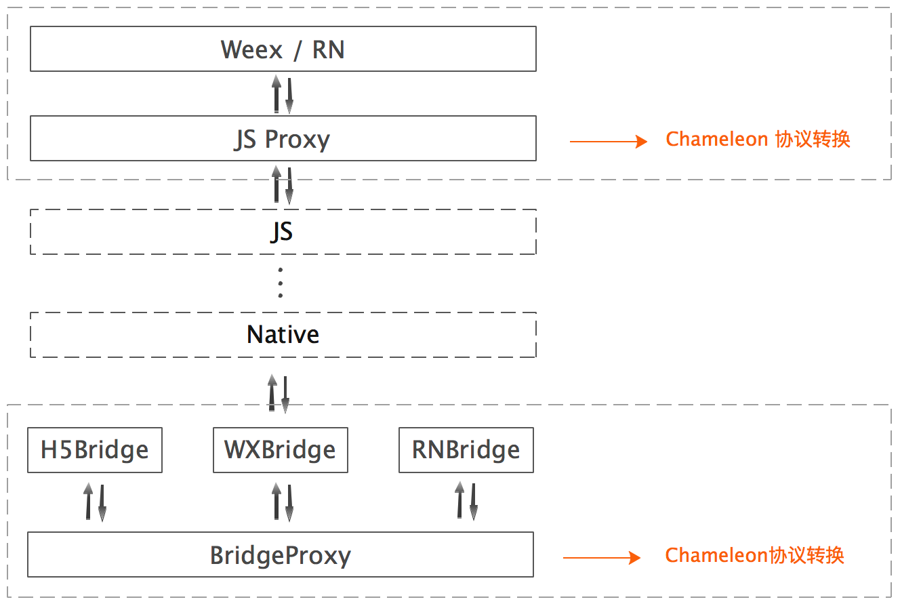

# 手把手教你系列- 变色龙SDK使用范例
以一个小demo工程，讲述变色龙SDK的使用方式，引领轻松入门。<font color=#FF0000>Demo 工程在根目录 app 目录下</font>，用 Android Studio 导入并 run 起来后，再对照以下说明文档看会好理解。

## 1. compile 依赖添加
### 1.1 项目根目录 build.gradle 里添加 maven 仓库地址
```
buildscript {
    repositories {
        jcenter()
        maven {
            url 'https://maven.google.com/'
        }
    }
    ...
}

allprojects {
    repositories {
        maven {
            url 'https://maven.google.com/'
        }
        jcenter()
        mavenCentral()
        ...
    }
}
```

### 1.2 在 app 模块的 build.gradle 里添加依赖
#### 1.2.1 首先添加如下依赖
```gradle
dependencies {
    ...
    compile "com.android.support:support-v4:$SUPPORT_VER"
    compile "com.android.support:appcompat-v7:$SUPPORT_VER"
    compile "com.android.support:recyclerview-v7:$SUPPORT_VER"
	compile "com.didiglobal.chameleon:cmlsdk:$VERSION"
	compile "com.didiglobal.chameleon:cmlweb:$VERSION"
}
```

#### 1.2.2 渲染引擎选择
目前只针对weex引擎实现的比较完整，<font color=#E69138>React Native即将支持</font>。 Chameleon SDK 当前依赖的weex 和 rn 版本分别是
- weex   -> com.taobao.android:weex_sdk:0.18.0
- rn sdk -> com.facebook.react:react-native:0.57.6


如果采用 weex 作为渲染引擎，还需要添加如下依赖
```gradle
dependencies {
    ...
	compile "com.didiglobal.chameleon:cmlweex:$VERSION"
}
```

如果采用 react native 作为渲染引擎<font color=#E69138>(即将支持)</font>，则需要添加如下依赖
```gradle
dependencies {
    ...
	compile "com.didiglobal.chameleon:cmlrn:$VERSION"
}
```
注意，上述渲染引擎依赖只能<font color=#FF0000>二者选其一</font>。com.android.tools.build:gradle 3.0 以后的版本用 `implementation` 替换 `compile`，完整的依赖列表可参考示例工程。

## 2. 权限添加及 android 6.0 以上系统授权
Chameleon SDK 已经添加了如下权限，android 6.0 以上系统版本需要在调起相关页面后手动授权。
```gradle
    <uses-permission android:name="android.permission.WRITE_EXTERNAL_STORAGE" />
    <uses-permission android:name="android.permission.READ_EXTERNAL_STORAGE" />
    <uses-permission android:name="android.permission.ACCESS_NETWORK_STATE" />
    <uses-permission android:name="android.permission.READ_PHONE_STATE" />
```

## 3. 混淆
参考示例工程

## 4. 初始化入口
实现自己的 Application 类，在应用启动的时候进行初始化调用。

### 4.1 Application demo
```java
public class MyApplication extends Application implements CmlConfig {
    @Override
    public void onCreate() {
        super.onCreate();

        CmlEngine.getInstance().init(this, this);
    }

    @Override
    public void configAdapter() {
        // 开发阶段可以禁用js bundle缓存
        CmlEnvironment.CML_ALLOW_BUNDLE_CACHE = false;
        // 开发阶段手动降级测试
//        CmlEnvironment.CML_DEGRADE = false;

        // 注册降级Adapter
        CmlEnvironment.setDegradeAdapter(new CmlDegradeDefault());
//        CmlEnvironment.setToastAdapter(xxx);
//        CmlEnvironment.setLoggerAdapter(xxx);
//        CmlEnvironment.setDialogAdapter(xxx);
//        CmlEnvironment.setNavigatorAdapter(xxx);
//        CmlEnvironment.setStatisticsAdapter(xxx);
//        CmlEnvironment.setImageLoaderAdapter(xxx);

    }

    @Override
    public void registerModule() {
        CmlEngine.getInstance().registerModule(ModuleDemo.class);
    }
}
```

### 4.2 将 Application 添加到 AndroidManifest.xml
```xml
<application
	android:name=".MyApplication"
	android:allowBackup="false"
	...
</application>
```

### 4.3 适配器的实现
适配器是暴露给SDK使用者的一组接口，用于提供扩展SDK的能力，其中一部分接口提供了默认实现，未提供默认实现的需要使用者自己实现并注册到SDK中。



- 以下适配器提供了默认实现
http / json / log / modal / storage / thread / websocket / imagloader

- 以下适配器未提供默认实现
navigator / degrade / statistics

以降级适配器举例，只需要两个步骤：
- 新建类 CmlDegradeDefault，实现接口 ICmlDegradeAdapter
- 在 MyApplication 的 configAdapter 方法里注册适配器。

### 4.4 module 的实现

module 的SDK层实现在如下位置：



module 的实现主要分两个步骤，一个是 native 侧的代码实现，一个是 js 侧的代码实现。同时，native 和 js 的通信是双向的，及native 可以主动调用 js 侧的方法，js 侧也可以主动调用 native 侧的方法。



#### 4.4.1 native 侧的实现
module 的实现需要先了解3个注解
- @CmlModule 标注这个类是扩展模块
- @CmlMethod 标注可供JS侧调用的方法
- @CmlParam  标注调用的参数

以下是一个 module 扩展示例
```
@CmlModule(alias = "moduleDemo")
public class ModuleDemo {
    @CmlMethod(alias = "sayHello")
    public void sayHello(ICmlActivityInstance instance, @CmlParam(name = "content") String content) {
        Toast.makeText(instance.getContext(), content, Toast.LENGTH_SHORT);
    }
}
```

注册到SDK
```
public class MyApplication extends Application implements CmlConfig {
    @Override
    public void onCreate() {
        super.onCreate();

        CmlEngine.getInstance().init(this, this);
        CmlEngine.getInstance().registerModule(ModuleDemo.class); // 在这里注册
    }
	...
}
```


#### 4.4.2 js 侧的实现
js方面，可以直接引入`chameleon-bridge`，使用提供的调用接口进行主动调用或者被动调用。
- callNative(module:String, method:String, args:Object, callback:Function) 主动调用客户端方法
- listenNative(module:String, method:String, callback:Function) 监听客户端调用js

```
import bridge from 'chameleon-bridge';

// 主动调用客户端方法
export function sayHello() {
    bridge.callNative(
        'moduleDemo', // 模块名
        'sayHello', // 方法名
        {}, // 参数
        res => {} // 回调方法
    );
}

// 监听客户端调用js
export function listenTell() {
    bridge.listenNative(
        'moduleDemo', // 模块名
        'NaTellJS', // 方法名
        res => {
         // 回调方法中处理返回的数据
        }
    );
}

```

### 4.5 js bundle 缓存的禁用
开发截断为了方便实时预览效果，可以关闭 js bundle 的缓存。
```
@Override
public void configAdapter() {
	// 开发阶段可以禁用js bundle缓存
	CmlEnvironment.CML_ALLOW_BUNDLE_CACHE = false;

	...

}
```

## 5. 页面调起

### 5.1 整个页面使用 Chameleon 容器实现
```java
CmlEngine.getInstance().launchPage(activity, url, options);

// 即将支持
CmlEngine.getInstance().launchPage(activity, url, options, requestCode, launchCallback);
```

### 5.2 使用CmlView（即将支持）

CmlView 用在和原生 Native View 混合布局的场景
```java
    private CmlView cmlView;

    @Override
    protected void onCreate(@Nullable Bundle savedInstanceState) {
        super.onCreate(savedInstanceState);
        setContentView(R.layout.activity_test_cml_view);
        FrameLayout flRoot = findViewById(R.id.fl_root);
        cmlView = new CmlView(this);
        flRoot.addView(cmlView, new FrameLayout.LayoutParams(ViewGroup.LayoutParams.MATCH_PARENT, ViewGroup.LayoutParams.MATCH_PARENT));
        cmlView.onCreate();
        cmlView.render(MainActivity.TEST_URL, null);
    }

    @Override
    protected void onResume() {
        super.onResume();
        if (cmlView != null) {
            cmlView.onResume();
        }
    }

    @Override
    protected void onPause() {
        super.onPause();
        if (cmlView != null) {
            cmlView.onPause();
        }
    }

    @Override
    protected void onDestroy() {
        super.onDestroy();
        if (cmlView != null) {
            cmlView.onDestroy();
        }
    }
```

### 5.3 打开普通URL
如果打开的是普通的URL，则会自动使用 CmlWebEngine 调起 Web Container，渲染 H5 页面

```
    // 演示打开一般的URL
    private static final String URL_NORMAL = "https://www.didiglobal.com";
    ...

    @Override
    public void onClick(View view) {
        switch (view.getId()) {
            case R.id.txt_open_url:
                CmlEngine.getInstance().launchPage(this, URL_NORMAL, null);
                break;
            ...
        }
    }
```

### 5.4 打开 JS Bundle
如果打开的是JS Bundle URL，则会自动使用 native 渲染引擎调起 native Container，渲染 JS Bundle

```
    // 这是一个可以正常打开的 JS_BUNDLE
    private static final String URL_JS_BUNDLE_OK = "https://static.didialift.com/pinche/gift/chameleon-ui-builtin/web/chameleon-ui-builtin.html?cml_addr=https%3A%2F%2Fstatic.didialift.com%2Fpinche%2Fgift%2Fchameleon-ui-builtin%2Fweex%2Fchameleon-ui-builtin.js";
    ...

    @Override
    public void onClick(View view) {
        switch (view.getId()) {
        	...
            case R.id.txt_open_js_bundle:
                CmlEngine.getInstance().launchPage(this, URL_JS_BUNDLE_OK, null);
                break;
            ...
        }
    }
```

### 5.5 预加载
如果打开的是一个已经预加载过的 JS Bundle URL，则会忽略下载过程，直接使用 native 渲染引擎渲染界面

```
    // 这是一个测试预加载的 JS_BUNDLE
    private static final String URL_JS_BUNDLE_PRELOAD = "https://static.didialift.com/pinche/gift/chameleon-ui-builtin/web/chameleon-ui-builtin.html?cml_addr=https%3A%2F%2Fstatic.didialift.com%2Fpinche%2Fgift%2Fchameleon-ui-builtin%2Fweex%2Fchameleon-ui-builtin.js";
    ...

    @Override
    public void onClick(View view) {
        switch (view.getId()) {
        	...
            case R.id.txt_preload:
                CmlEngine.getInstance().launchPage(this, URL_JS_BUNDLE_PRELOAD, null);
                break;
            ...
        }
    }
```

### 5.6 自动降级
如果打开的是一个错误的JS Bundle URL，则会自动降级，使用 CmlWebEngine 调起 Web Container，渲染前面 H5 地址页面，具体可以查看

- 工程化 -> Chameleon URL 一节关于，Chameleon URL 的定义
- Native渲染能力接入 -> 自动降级 一节，关于自动降级的详细说明


```
    // 这是一个错误的 JS_BUNDLE
    private static final String URL_JS_BUNDLE_ERR = "https://www.didiglobal.com?cml_addr=xxx.js";
    ...

    @Override
    public void onClick(View view) {
        switch (view.getId()) {
            ...
            case R.id.txt_degrade:
                CmlEngine.getInstance().launchPage(this, URL_JS_BUNDLE_ERR, null);
                break;
        }
    }
```

## 6. 预加载
如果某些 js bundle 不需要实时下载下来渲染，可以先配置到预加载列表里提前下载下来，提升用户交互体验。

### 6.1 预加载列表的配置

组装 CmlBundle 列表，并通过 CmlEngine 接口设置到SDK里，具体可以参考 demo。
```
   private List<CmlBundle> getPreloadList() {
        CmlJsBundleEnvironment.DEBUG = true;
        List<CmlBundle> cmlModels = new ArrayList<>();
        CmlBundle model = new CmlBundle();
        model.bundle = Util.parseCmlUrl(URL_JS_BUNDLE_PRELOAD);
        model.priority = 2;
        cmlModels.add(model);
        return cmlModels;
    }

    ...

    CmlEngine.getInstance().initPreloadList(getPreloadList());
```

### 6.2 开始预加载列表

根据使用方的业务，在适当位置执行预加载
```
CmlEngine.getInstance().performPreload();
```
